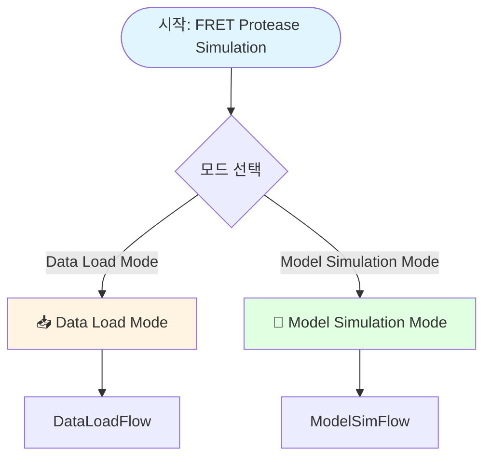
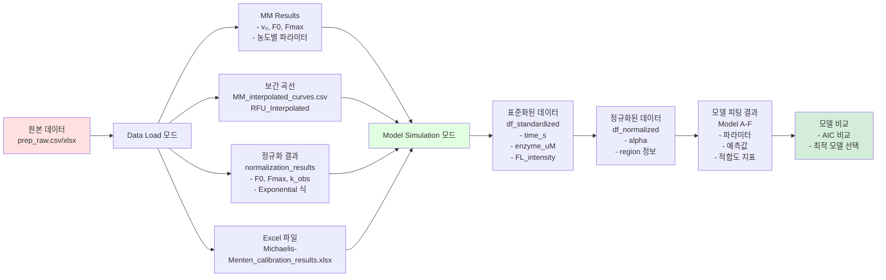

# Data Load부터 분석까지 전체 Flowchart

## 전체 프로세스 개요



---

## 1. Data Load 모드 상세 Flowchart

```mermaid
flowchart TD
    Start([Data Load 모드 시작])
    
    Start --> ExpType{Experiment Condition Selection}
    ExpType -->|Substrate Concentration Variation| SubExp[Standard MM Applicable]
    ExpType -->|Enzyme Concentration Variation| EnzExp[Linear Relationship, MM Not Applicable]
    
    SubExp --> FileUpload
    EnzExp --> FileUpload
    
    FileUpload{File Upload}
    FileUpload -->|CSV/XLSX Upload| UploadFile[Read Uploaded File]
    FileUpload -->|No File| DefaultFile[Use Default Sample File]
    
    UploadFile --> ReadData[원본 데이터 읽기<br/>read_raw_data]
    DefaultFile --> ReadData
    
    ReadData --> Step1[1️⃣ 각 농도별 시간 경과 곡선 피팅]
    
    Step1 --> FitCurve[각 농도별 곡선 피팅<br/>- 초기 속도 v₀ 계산<br/>- F0, Fmax 추출<br/>- 최적화된 선형 구간 선택<br/>R² 최대화]
    
    FitCurve --> Step2[2️⃣ 보간 범위 계산]
    Step2 --> CalcRange[시간 범위 결정<br/>x_range_min, x_range_max<br/>보간 포인트: 1001개]
    
    CalcRange --> Step3[3️⃣ 보간 곡선 생성]
    Step3 --> Interp1[선형 보간<br/>F = F0 + v₀ × t<br/>임시 보간 곡선]
    
    Interp1 --> Step4[4️⃣ v₀ vs 농도 피팅]
    
    Step4 --> CheckExp{실험 타입}
    CheckExp -->|Substrate 농도 변화| MMFit[Michaelis-Menten 피팅<br/>v₀ = Vmax × [S] / Km + [S]<br/>Vmax, Km, kcat 계산]
    CheckExp -->|Enzyme 농도 변화| LinearFit[선형 피팅<br/>v₀ = slope × [E] + intercept]
    
    MMFit --> Step5[5️⃣ 결과 저장]
    LinearFit --> Step5
    
    Step5 --> SaveFiles[파일 저장<br/>- MM_interpolated_curves.csv<br/>- MM_results_detailed.csv]
    
    SaveFiles --> Step6[6️⃣ 정규화 수행]
    Step6 --> Normalize[각 농도별 정규화<br/>- 반복 정규화 2회<br/>- Exponential 식 피팅<br/>F = F0 + Fmax-F0 × 1-exp-k_obs×t<br/>- F0, Fmax, k_obs, τ 추출]
    
    Normalize --> Step7[7️⃣ 정규화 기반 v₀로 MM 피팅 재수행]
    Step7 --> NormMMFit[정규화 기반 v₀ 사용<br/>v₀ = k_obs × Fmax-F0]
    
    NormMMFit --> CheckExp2{실험 타입}
    CheckExp2 -->|Substrate| NormMM[MM 피팅 재수행<br/>Vmax, Km, kcat 재계산]
    CheckExp2 -->|Enzyme| NormLinear[선형 피팅 재수행]
    
    NormMM --> Step8[8️⃣ 정규화 기반 보간 곡선 재생성]
    NormLinear --> Step8
    
    Step8 --> Interp2[Exponential 식 사용<br/>F = F0 + Fmax-F0 × 1-exp-k_obs×t<br/>최종 보간 곡선]
    
    Interp2 --> SaveSession[Session State 저장<br/>interpolation_results]
    SaveSession --> SaveXLSX[Excel 파일 생성<br/>Michaelis-Menten_calibration_results.xlsx<br/>- Michaelis-Menten Curves<br/>- MM Results<br/>- MM Fit Results]
    
    SaveXLSX --> Complete[✅ Data Load 완료<br/>결과적용됨 표시]
    
    Complete --> End([Data Load 모드 종료])
    
    style Start fill:#fff4e1
    style Complete fill:#d4edda
    style End fill:#e1f5ff
```

---

## 2. Model Simulation 모드 상세 Flowchart

```mermaid
flowchart TD
    Start([Model Simulation 모드 시작])
    
    Start --> Config[Input Settings<br/>- Enzyme Molecular Weight kDa<br/>- Enzyme Name<br/>- Substrate Name]
    
    Config --> DataSource{Select Data Source}
    
    DataSource -->|Priority 1| SessionState[Check Session State<br/>If just executed from<br/>Data Load Mode]
    DataSource -->|Priority 2| FileUpload[Upload CSV/XLSX File]
    DataSource -->|Priority 3| AutoLoad[Auto Load File<br/>1st: XLSX<br/>2nd: CSV]
    
    SessionState -->|Success| LoadMemory[Load from Memory<br/>interpolation_results]
    SessionState -->|Failure| FileUpload
    
    FileUpload -->|XLSX| LoadXLSX[Read "Michaelis-Menten Curves" Sheet]
    FileUpload -->|CSV| LoadCSV[Read CSV File]
    
    AutoLoad -->|XLSX Exists| LoadXLSX
    AutoLoad -->|CSV Only| LoadCSV
    AutoLoad -->|No File| Error[Error: File Not Found]
    
    LoadMemory --> ResultApplied[Display "Results Applied"<br/>Substrate-based/Enzyme-based]
    LoadXLSX --> ResultApplied
    LoadCSV --> ResultApplied
    
    ResultApplied --> Step1[Step 1: 데이터 변환]
    Step1 --> ConvertData[df_fitted → df_raw 변환<br/>- Time_min<br/>- enzyme_ugml<br/>- FL_intensity<br/>- SD]
    
    ConvertData --> Step2[Step 2: 단위 표준화]
    Step2 --> Standardize[UnitStandardizer<br/>- 시간: min → s<br/>- 농도: μg/mL → μM<br/>- 형광: RFU → FL_intensity]
    
    Standardize --> GetParams{파라미터 소스}
    GetParams -->|우선순위 1| NormResults[normalization_results<br/>Exponential 식 F0, Fmax]
    GetParams -->|우선순위 2| InterpValues[Interpolated 값<br/>최소/최대값]
    GetParams -->|우선순위 3| MMResults[MM Results 시트<br/>F0, Fmax]
    
    NormResults --> Step3[Step 3-1: 임시 정규화]
    InterpValues --> Step3
    MMResults --> Step3
    
    Step3 --> TempNorm[DataNormalizer.normalize_temporary<br/>Model-free Threshold<br/>또는 fitted_params 사용]
    
    TempNorm --> Step4[Step 4: 구간 구분]
    Step4 --> DivideRegions[RegionDivider.divide_regions<br/>- 초기 선형 구간<br/>- 지수 증가 구간<br/>- Plateau 구간]
    
    DivideRegions --> Step5[Step 5: 최종 정규화]
    Step5 --> FinalNorm[DataNormalizer.normalize_final<br/>Region-based 정규화<br/>또는 fitted_params 사용]
    
    FinalNorm --> Tabs[탭 선택]
    
    Tabs --> Tab1[📊 v₀ vs [S] Fit Tab]
    Tabs --> TabAlpha[📈 Alpha Calculation Tab]
    Tabs --> Tab2[🔬 Model Fitting Tab]
    Tabs --> TabDesc[📖 Model Description Tab]
    Tabs --> Tab3[📉 Model Comparison Tab]
    Tabs --> Tab4[💡 Diagnostic Analysis Tab]
    
    Tab2 --> ModelFitting{Select Model}
    ModelFitting --> ModelA[Model A: Substrate Depletion]
    ModelFitting --> ModelB[Model B: Enzyme Deactivation]
    ModelFitting --> ModelC[Model C: Mass Transfer Limitation]
    ModelFitting --> ModelD[Model D: Concentration Dependent Fmax]
    ModelFitting --> ModelE[Model E: Product Inhibition]
    ModelFitting --> ModelF[Model F: Enzyme Surface Sequestration]
    
    ModelA --> FitGlobal[Perform Global Fitting<br/>Simultaneous Fitting for All Concentrations]
    ModelB --> FitGlobal
    ModelC --> FitGlobal
    ModelD --> FitGlobal
    ModelE --> FitGlobal
    ModelF --> FitGlobal
    
    FitGlobal --> CalcMetrics[Calculate Goodness of Fit Metrics<br/>- R²<br/>- AIC<br/>- BIC<br/>- RMSE]
    
    CalcMetrics --> Tab3
    
    Tab3 --> CompareModels[Model Comparison Table<br/>- Parameter Comparison<br/>- Goodness of Fit Metrics Comparison<br/>- AIC-based Model Selection]
    
    CompareModels --> Visualize[Visualization<br/>- Prediction Curves<br/>- Residual Plots<br/>- Parameter Distribution]
    
    Visualize --> End([Model Simulation 모드 종료])
    
    style Start fill:#e1ffe1
    style End fill:#e1f5ff
    style ResultApplied fill:#d4edda
    style FitGlobal fill:#fff4e1
```

---

## 3. 데이터 흐름 다이어그램



---

## 4. 주요 처리 단계 상세

### 4.1 Data Load 모드 처리 단계

| 단계 | 설명 | 출력 |
|------|------|------|
| 1️⃣ | Fit time course curves for each concentration | v₀, F0, Fmax, R² |
| 2️⃣ | Calculate interpolation range | x_range_min, x_range_max, 1001 points |
| 3️⃣ | Generate interpolation curves (temporary) | Linear interpolation: F = F0 + v₀ × t |
| 4️⃣ | Fit v₀ vs concentration | MM: Vmax, Km, kcat or Linear: slope, intercept |
| 5️⃣ | Save results | CSV files |
| 6️⃣ | Perform normalization | Exponential equation: F0, Fmax, k_obs, τ |
| 7️⃣ | Re-perform MM fitting with normalized v₀ | Normalized Vmax, Km, kcat |
| 8️⃣ | Regenerate interpolation curves based on normalization | Exponential interpolation: F = F0 + (Fmax-F0) × [1-exp(-k_obs×t)] |

### 4.2 Model Simulation 모드 처리 단계

| 단계 | 설명 | 출력 |
|------|------|------|
| Step 1 | Data Conversion | df_fitted → df_raw |
| Step 2 | Unit Standardization | time_s, enzyme_uM, FL_intensity |
| Step 3-1 | Temporary Normalization | Model-free Threshold or fitted_params |
| Step 4 | Region Division | Initial Linear, Exponential Growth, Plateau Regions |
| Step 3-2 | Final Normalization | Region-based Normalization or fitted_params |
| Model Fitting | Global Fitting of 6 Models | Parameters, R², AIC, BIC, RMSE |
| Model Comparison | Goodness of Fit Metrics Comparison | Optimal Model Selection |

---

## 5. 파일 구조 및 데이터 저장

```
프로젝트 루트/
├── raw/
│   ├── raw_substrate.csv      # Substrate 농도 변화 샘플
│   └── raw_enzyme.csv         # Enzyme 농도 변화 샘플
│
├── data_interpolation_mode/
│   └── results/
│       └── MM_interpolated_curves.csv  # 보간 곡선 데이터
│
├── prep_raw_data_mode/
│   └── results/
│       └── MM_results_detailed.csv    # 상세 MM 결과
│
└── Michaelis-Menten_calibration_results.xlsx  # 최종 Excel 결과
    ├── Michaelis-Menten Curves  # 보간 곡선 시트
    ├── MM Results               # 농도별 파라미터 시트
    └── MM Fit Results           # MM 피팅 결과 시트
```

---

## 6. Session State 데이터 구조

### Data Load 모드 저장 데이터
```python
st.session_state['interpolation_results'] = {
    'interp_df': DataFrame,              # 보간 곡선 데이터
    'mm_results_df': DataFrame,          # MM 결과 데이터프레임
    'mm_results': dict,                  # 원본 v₀ 결과 (초기속도 탭용)
    'mm_fit_results': dict,              # 정규화 기반 MM fit 결과
    'x_range_min': float,                # 보간 범위 최소값
    'x_range_max': float,                # 보간 범위 최대값
    'x_data_min': float,                 # 원본 데이터 최소값
    'x_data_max': float,                 # 원본 데이터 최대값
    'raw_data': dict,                    # 원본 raw 데이터
    'v0_vs_concentration': {
        'concentrations': list,           # 정규화 기반 농도
        'v0_values': list                # 정규화 기반 v₀
    },
    'experiment_type': str,              # 실험 타입
    'normalization_results': dict         # 정규화 결과 (F0, Fmax, k_obs 등)
}

st.session_state['mm_data_ready'] = True  # 결과 적용 플래그
```

### Model Simulation 모드 저장 데이터
```python
st.session_state['fit_results'] = [ModelResults, ...]  # 모델 피팅 결과 리스트
st.session_state['df'] = DataFrame                     # 정규화된 데이터
st.session_state['fitted_params'] = dict               # F0, Fmax 파라미터
st.session_state['df_fitted_original'] = DataFrame    # 원본 fitted 데이터
st.session_state['rfu_col'] = str                     # RFU 컬럼 이름
```

---

## 7. 주요 함수 및 클래스

### Data Load 모드
- `read_raw_data()`: 원본 데이터 읽기
- `fit_time_course()`: 시간 경과 곡선 피팅
- `calculate_initial_velocity_optimized()`: 최적화된 초기 속도 계산
- `fit_calibration_curve()`: MM 또는 선형 피팅
- `normalize_iterative()`: 반복 정규화

### Model Simulation 모드
- `UnitStandardizer`: 단위 표준화
- `DataNormalizer`: 데이터 정규화
- `RegionDivider`: 구간 구분
- `ModelA_SubstrateDepletion`: 모델 A
- `ModelB_EnzymeDeactivation`: 모델 B
- `ModelC_MassTransfer`: 모델 C
- `ModelD_ConcentrationDependentFmax`: 모델 D
- `ModelE_ProductInhibition`: 모델 E
- `ModelF_EnzymeSurfaceSequestration`: 모델 F
- `Visualizer`: 시각화 및 비교

---

## 8. 모델 피팅 우선순위

### Data Load 모드
1. **Session State** (메모리) - Data Load 모드에서 방금 실행된 경우
2. **파일 업로드** - 사용자가 직접 업로드
3. **자동 파일 로드** - XLSX 우선, CSV 차순위

### Model Simulation 모드 - F0, Fmax 파라미터
1. **normalization_results** - Exponential 식에서 나온 F0, Fmax (가장 정확)
2. **Interpolated 값** - 최소/최대값에서 계산
3. **MM Results 시트** - Excel 파일에서 읽기

---

## 9. 결과 표시 및 시각화

### Data Load Mode
- Michaelis-Menten Model Results (Vmax, Km, kcat, R²)
- Initial Velocity vs Concentration Graph
- Interpolation Curve Graph
- Normalization Results

### Model Simulation Mode
- **v₀ vs [S] Fit Tab**: MM Fitting Graph
- **Alpha Calculation Tab**: Visualization of Normalized α Values
- **Model Fitting Tab**: Select and Fit 6 Models
- **Model Description Tab**: Equations and Descriptions for Each Model
- **Model Comparison Tab**: Model Comparison Table and Graphs
- **Diagnostic Analysis Tab**: Additional Analysis Tools

---

## 10. 에러 처리 및 예외 상황

### Data Load 모드
- 파일 읽기 실패 → 오류 메시지 표시
- MM 피팅 실패 → 경고 메시지, 계속 진행
- 정규화 실패 → fallback 방법 사용

### Model Simulation 모드
- 데이터 파일 없음 → 오류 메시지 및 중단
- 파라미터 로드 실패 → Interpolated 값 사용
- 모델 피팅 실패 → 오류 메시지, 다른 모델 계속 진행

---

## 참고사항

- **실험 타입**: Substrate 농도 변화 vs Enzyme 농도 변화에 따라 처리 방식이 다름
- **정규화**: Exponential 식 기반 정규화가 가장 정확한 결과 제공
- **모델 선택**: AIC 값이 낮을수록 더 좋은 모델
- **데이터 연속성**: Data Load 모드 → Model Simulation 모드로 자동 전달 (Session State)

