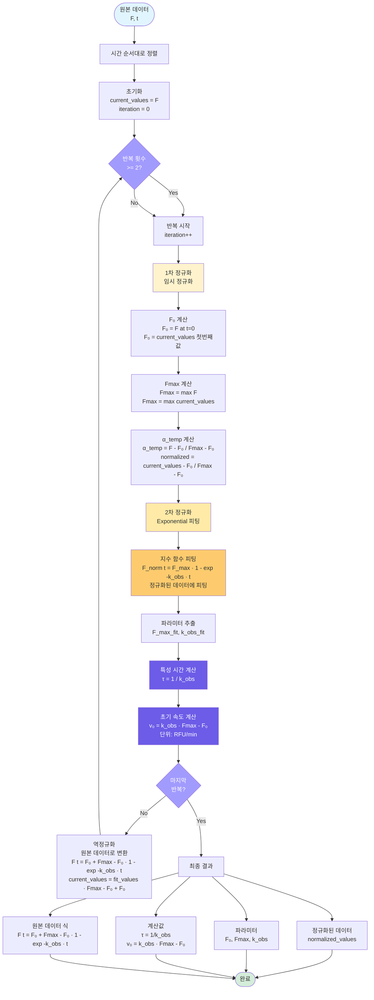

# 정규화 과정 플로우차트

## 정규화 과정 상세 설명

### 1차 정규화 (임시 정규화)
- **F₀**: 시간 0에서의 형광값 (F(t=0))
- **Fmax**: 최대 형광값 (max(F))
- **정규화**: α_temp = (F - F₀) / (Fmax - F₀)

### 2차 정규화 (Exponential 피팅)
- **정규화된 데이터 식**: F_norm(t) = F_max · [1 - exp(-k_obs · t)]
  - F_norm(t): 정규화된 형광값 (0~1 범위)
  - F_max: 정규화된 최대값 (보통 1.0)
  - k_obs: 관찰된 반응 속도 상수 (분⁻¹)
  - t: 시간 (분)

### 원본 데이터로 변환
- **원본 데이터 식**: F(t) = F₀ + (Fmax - F₀) · [1 - exp(-k_obs · t)]
  - F(t): 시간 t에서의 형광값
  - F₀: 초기 형광값
  - Fmax: 최대 형광값
  - k_obs: 관찰된 반응 속도 상수 (분⁻¹)
  - t: 시간 (분)

### 초기 속도 (v₀) 계산
- **v₀ = k_obs · (Fmax - F₀)**
- 단위: RFU/min (형광 단위/분)

### 특성 시간 (τ)
- **τ = 1 / k_obs**
- 반응이 63.2% 완료되는 시간

### 반복 정규화
- 위 과정을 최소 2번 반복하여 정규화를 개선
- 각 반복에서 피팅된 값을 역정규화하여 다음 반복에 사용

